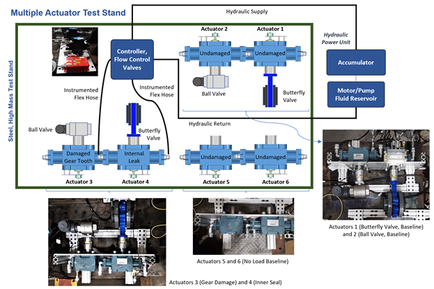

# Hydraulic Actuator Data Set

Hydraulic actuators are used across the shipping industry and are installed in various environments performing a wide array of operations.  Their widespread use necessitates a condition-based maintenance program, ideally utilizing machine learning models to provide real-time estimates of the health condition, to maintain an acceptable level of fleet readiness.  This repository contains a hydraulic actuator dataset collected from six industrial actuators under various fault conditions and loads.  This repository also contains code for running a variety of baseline experiments on the data set.  

## Data Set Description

  

The test stand used in this study was built using a collection of six 15,000 in lbf industrial rotary actuators manufactured by Moog Flo-Tork. Luna Labs' eCBM node was used to monitor inlet / outlet pressure conditions, temperature, position, and acceleration.  The data set is composed of examples collected from hydraulic actuators in a baseline condition and two faulty conditions - Gear Damage and Seal Damage.  Each of the six actuators corresponds to a different condition.

## Code

The scripts execute the baseline machine learning experiments.

* CNN_train_script.py - damage classification
* CNN_train_damage_script.py - damage type classification
* CNN_train_load_script.py - load classification
* CNN_train_actuator_script.py - actuator classification
* CNN_train_new_condition_script.py - damage classification with a new condition

## Requirements
* matplotlib
* pandas
* numpy
* scikit-learn
* pytorch

## License
[MIT](https://choosealicense.com/licenses/mit/)
